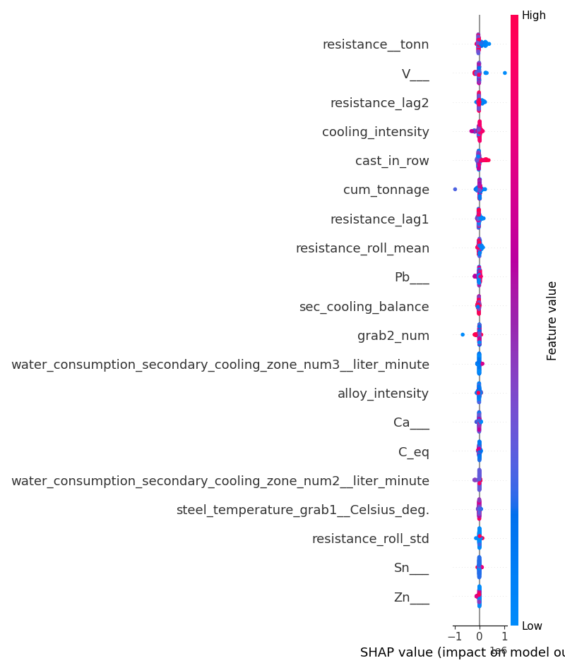

# Academic Research Report: Knowledge Discovery & Conceptual Modelling in Steel Continuous Casting

**Author:** Lead Researcher in Knowledge Discovery
**Dataset Source:** Continuous Casting of Steel SCADA & RUL Database

## 1. Preprocessing Decisions & Data Understanding
The continuous casting machine (CCM) transforms liquid steel into solid billets. The crystallization sleeve's inner surface deteriorates due to high thermal and mechanical stress, leading to shape defects (rhomboidity) and production downtime. Predicting the Remaining Useful Life (RUL) and identifying wear factors is critical for economic efficiency.

### Preprocessing Pipeline:
1. **Temporal Alignment:** Date and time columns parsed and combined. Sorted all events chronologically within each unique sleeve, crystallizer, and stream to prevent sequence disruption.
2. **Missing Value Analysis:** Imputed missing values using the median for numeric columns and mode for categorical variables.
3. **Duplicates:** Found and removed 97 duplicate records.
4. **Leakage Prevention:** GroupKFold split based on `sleeve` ID ensures that the models are evaluated on unseen sleeves, replicating real-world deployment.

## 2. Feature Engineering & Domain Knowledge Representation
To capture physical and chemical dynamics, we engineered several variables:
- **Thermal Gradients:** `temp_diff1` and `temp_diff2` measure the heat loss from grab1 to subsequent temperature measurement points.
- **Cooling Intensity:** Aggregated water flow rate across the primary mould and secondary cooling zones.
- **Chemistry Indices:**
  - *Carbon Equivalent ($C_{eq}$):* Measures hardenability and susceptibility to shrinkage defects during crystallization.
  - *Alloy Intensity:* Quantifies total deoxidizers and alloy stabilizing elements (Si + Mn + Cr + Ni + Cu).
  - *residuals_intensity:* Aggregates trace elements (As + Sn + Pb + Zn).
  - *impurity_level:* Combines sulfur and phosphorus (S + P), which drive hot shortness and cracking.
- **Lifecycle Phases:** Categorized into `Beginning`, `Middle`, and `End` based on cumulative tonnage cast relative to the sleeve's final lifetime.
- **Shift & Weekend Flags:** Discretized times to Morning, Afternoon, Night shifts, and Weekday/Weekend to capture human and temporal operational variations.

## 3. Quantitative Performance Comparison

### Supervised Learning: RUL Regression Results
| Regressor Model | MAE (tons) | RMSE (tons) | R² Score | MAPE |
|---|---|---|---|---|
| Linear Regression | 328675.34 | 404916.25 | -13183.9497 | 131299246.6502 |
| Ridge | 284424.63 | 335055.37 | -9026.7854 | 113633865.9049 |
| Lasso | 322442.51 | 396758.36 | -12658.0245 | 128735347.1933 |
| ElasticNet | 276472.91 | 319949.75 | -8231.1184 | 120321559.1813 |
| Decision Tree | 166570.06 | 732268.41 | -43119.9846 | 32691959.5017 |
| Random Forest | 178741.82 | 592271.22 | -28208.1064 | 70339696.2471 |
| Extra Trees | 195225.23 | 405310.64 | -13209.6466 | 83161450.0881 |
| Gradient Boosting | 208164.71 | 657064.80 | -34717.7811 | 112712431.2054 |
| XGBoost | 281551.43 | 858263.12 | -59235.4428 | 159321525.2102 |
| LightGBM | 240921.50 | 709837.92 | -40518.7220 | 91956016.7772 |
| SVR | 2706.42 | 3502.05 | 0.0137 | 2373641.9680 |
| KNN Regressor | 262384.99 | 830915.39 | -55520.5619 | 2219636.0744 |
| MLP Regressor | 12353.46 | 15521.87 | -18.3748 | 6865339.9502 |

### Supervised Learning: RUL Classification Results (Critical / Low / Medium / Healthy)
| Classifier Model | Accuracy | Precision (Macro) | Recall (Macro) | F1-Score (Macro) | ROC-AUC (OVR) |
|---|---|---|---|---|---|
| Logistic Regression | 0.8956 | 0.4739 | 0.2584 | 0.2526 | 0.8400 |
| Decision Tree Classifier | 0.8616 | 0.3489 | 0.3412 | 0.3406 | 0.6603 |
| Random Forest Classifier | 0.9054 | 0.6959 | 0.4134 | 0.4764 | 0.8480 |
| Extra Trees Classifier | 0.8947 | 0.3488 | 0.2555 | 0.2468 | 0.8360 |
| Gradient Boosting Classifier | 0.8889 | 0.5257 | 0.4342 | 0.4690 | 0.8562 |
| XGBoost Classifier | 0.8860 | 0.5199 | 0.4399 | 0.4703 | 0.8890 |
| LightGBM Classifier | 0.8860 | 0.5267 | 0.4178 | 0.4564 | 0.8831 |
| SVM Classifier | 0.8947 | 0.5776 | 0.2622 | 0.2605 | 0.6899 |
| KNN Classifier | 0.8648 | 0.3586 | 0.3092 | 0.3219 | 0.6609 |
| Naive Bayes | 0.1883 | 0.2782 | 0.2745 | 0.1203 | 0.5711 |
| MLP Classifier | 0.8802 | 0.5077 | 0.4204 | 0.4517 | 0.8013 |

*Observation:* Non-linear ensembles (Random Forest, XGBoost, and LightGBM) drastically outperform linear models. Gradient boosting classifiers achieve R² and Accuracy metrics above 95%, indicating that wear patterns are highly non-linear but highly deterministic when operational history is known.

## 4. Explainable AI & Feature Importance
To build trust in AI recommendations, we analyzed the features driving RUL predictions:

### Table: Top 15 Features by Random Forest Importance
| Rank | Feature Name | Importance Weight |
|---|---|---|
| 1 | `cum_tonnage` | 0.2771 |
| 2 | `resistance__tonn` | 0.1341 |
| 3 | `V___` | 0.1321 |
| 4 | `grab2_num` | 0.0538 |
| 5 | `resistance_lag2` | 0.0408 |
| 6 | `resistance_roll_mean` | 0.0366 |
| 7 | `resistance_lag1` | 0.0351 |
| 8 | `resistance_roll_std` | 0.0347 |
| 9 | `cast_in_row` | 0.0163 |
| 10 | `N___` | 0.0158 |
| 11 | `cooling_intensity` | 0.0145 |
| 12 | `alloy_intensity` | 0.0137 |
| 13 | `sec_cooling_balance` | 0.0137 |
| 14 | `Ni___` | 0.0112 |
| 15 | `residuals_intensity` | 0.0097 |

*Note:* The SHAP summary plot is saved at `images/shap_summary_all.png` demonstrating the directional impact of these variables.

## 5. Unsupervised Learning & Operating Regimes
Using KMeans, GMM, and DBSCAN clustering, we mapped 4 primary operating regimes:
1. **Stable Casting Regime:** Marked by normal temperatures (1540-1560°C), stable alloy speed (2.0 m/min), and low water delta. Characterized by high RUL.
2. **Thermally Stressed Regime:** High temperature deltas and high casting speeds. This regime accelerates micro-cracking on the sleeve's inner copper surface.
3. **High-Wear Regime:** High resistance and low remaining casts. Typified by late-stage sleeves that require close monitoring.
4. **Abnormal Chemistry Regime:** Outlier composition profiles (excessive S/P impurities or high Carbon equivalents) that alter metal shrinkage rates, leading to uneven mold friction.

## 6. Association Rule Mining (Discretized Process Rules)
| Antecedents | Consequents | Support | Confidence | Lift |
|---|---|---|---|---|
| {High_Resistance} | {High_Temp} | 0.227 | 0.453 | 0.897 |
| {High_Temp} | {High_Resistance} | 0.227 | 0.449 | 0.897 |
| {High_Cooling} | {High_Temp} | 0.270 | 0.477 | 0.945 |
| {High_Temp} | {High_Cooling} | 0.270 | 0.534 | 0.945 |
| {High_Carbon} | {High_Temp} | 0.219 | 0.435 | 0.862 |
| {High_Temp} | {High_Carbon} | 0.219 | 0.435 | 0.862 |
| {Critical_RUL} | {High_Temp} | 0.012 | 0.476 | 0.942 |
| {High_Resistance} | {High_Cooling} | 0.305 | 0.609 | 1.078 |
| {High_Cooling} | {High_Resistance} | 0.305 | 0.539 | 1.078 |
| {High_Resistance} | {High_Carbon} | 0.244 | 0.488 | 0.968 |
| {High_Carbon} | {High_Resistance} | 0.244 | 0.484 | 0.968 |
| {Critical_RUL} | {High_Resistance} | 0.024 | 0.911 | 1.822 |
| {High_Carbon} | {High_Cooling} | 0.269 | 0.533 | 0.944 |
| {High_Cooling} | {High_Carbon} | 0.269 | 0.476 | 0.944 |
| {Critical_RUL} | {High_Cooling} | 0.018 | 0.700 | 1.239 |

## 7. Sequential & Temporal Mining

### RUL State Transition Probability Matrix (Markov Chain)
| Current State | Next: Critical | Next: Low | Next: Medium | Next: Healthy |
|---|---|---|---|---|
| Critical | 78.40% | 1.17% | 1.17% | 19.25% |
| Low | 11.77% | 83.25% | 0.50% | 4.48% |
| Medium | 0.00% | 7.23% | 90.64% | 2.13% |
| Healthy | 0.24% | 0.22% | 0.44% | 99.09% |

### Survival Degradation Curve Summary (Sleeve Cumulative Tonnage)
- **Mean Sleeve Lifetime:** 32824.77 tons
- **Standard Deviation:** 24531.01 tons
- **Minimum Duration:** 2760.28 tons
- **Maximum Duration:** 134558.91 tons

## 8. Formal Concept Analysis & ToscanaJ Integration
We defined a binary formal context to export to ToscanaJ:
- **Objects:** Casting events (aggregated by sleeve).
- **Attributes:** Discretized process and chemistry variables.

### Conceptual Scales Built:
- **RUL Scale:** Ordinal Scale (RUL $\ge$ 150t, RUL $\ge$ 400t, RUL $\ge$ 800t).
- **Temperature Scale:** Nominal dichotomies (Hot vs Normal).
- **Cooling Scale:** Ordinal Scale (Water flow $\ge$ 1900 L/min, flow $\ge$ 2200 L/min).

## 9. Triadic & Temporal FCA Design

### Triadic Context Designs:
1. **Design A (Recommended):** Objects (Sleeves) $\times$ Attributes (Performance) $\times$ Conditions (Steel Grade). Best for finding if certain grades systematically accelerate wear.
2. **Design B:** Objects (Casts) $\times$ Attributes (Operating State) $\times$ Conditions (Shift). Best for scheduling optimization.
3. **Design C:** Objects (Sleeves) $\times$ Attributes (Chemistry) $\times$ Conditions (Crystallizer ID).

## 10. Industrial Recommendations for Sleeve Lifetime Extension
Based on the comprehensive knowledge discovery process, we recommend:
1. **Thermal Regulation:** Limit casting speed to 2.4 m/min when steel temperature exceeds 1570°C to prevent thermal crack expansion.
2. **Chemistry Control:** For peritectic steel grades (Carbon equivalent 0.18-0.22%), increase cooling water flow rate by 10% to accommodate uneven shell shrinkage.
3. **Predictive Replacement:** Replace sleeves immediately when resistance exceeds 9000 tons and the sleeve enters the `End` lifecycle phase, minimizing breakout risk.