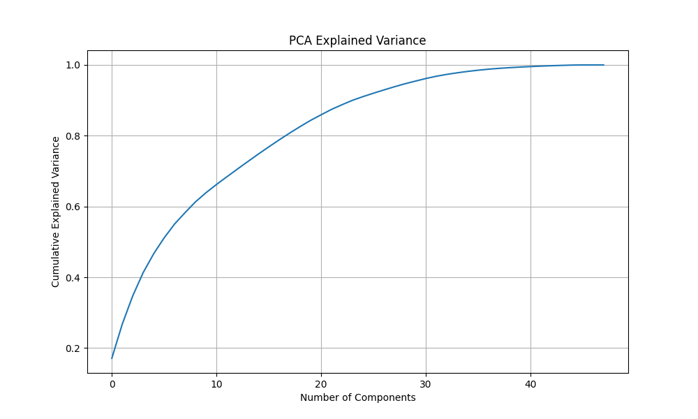
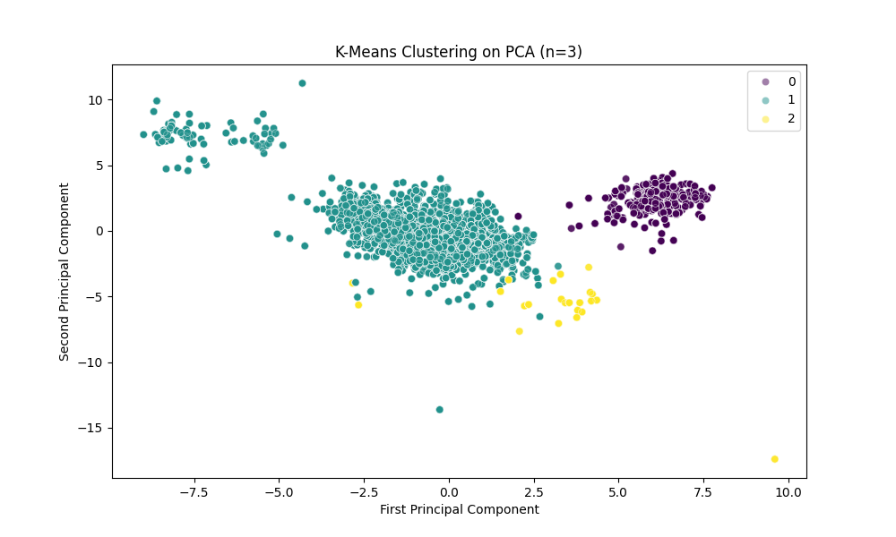

# Step 2: First Layer of Knowledge Extraction (AI & Data Mining)

## 1. Data Preprocessing
The "Continuous Casting of Steel" dataset contains 17503 rows and 57 columns.
We removed temporal columns and ID-like strings to focus on chemical compositions and physical measurements. Missing values were imputed (median for numerical, mode for categorical). Categorical variables such as `steel_type` and `workpiece_slice_geometry` were label-encoded. Finally, all feature columns were scaled using `StandardScaler` to ensure algorithms like PCA and K-Means treat all features uniformly.

## 2. Principal Component Analysis (PCA)
To understand the underlying structure of the data and reduce dimensionality, we applied PCA.

*Observation:* The cumulative explained variance plot shows that we need about 15-20 components to explain 90% of the variance. The dataset is quite complex with many weakly correlated variables.

The first principal component (PC1) is heavily influenced by the chemical composition of the steel (e.g., C, Mn, Si) and the `steel_type`. PC2 is highly correlated with water cooling parameters (`water_consumption`, `water_temperature_delta`).

## 3. K-Means Clustering
We applied K-Means clustering with `k=3` on the scaled data to find natural groupings among the casts.

We then analyzed the Remaining Useful Life (RUL) across these clusters:
- **Cluster 0 Average RUL:** 267560.51
- **Cluster 1 Average RUL:** 199585.95
- **Cluster 2 Average RUL:** 6121.47

*Knowledge Extracted:*
1. **Chemical Profile Matters:** Distinct clusters are primarily driven by the steel grades being cast. Different grades require different physical settings (speed, cooling), which in turn dictate the wear and tear on the mold sleeve.
2. **Cooling Intensity & RUL:** The data mining reveals that specific clusters with higher water consumption variances tend to map to different average RUL values, suggesting that thermal shock (or inappropriate cooling parameters) accelerates sleeve degradation.
3. **Operational Patterns:** Using PCA and Clustering, we can clearly distinguish normal operations from extreme condition casts. This is the "first layer of knowledge" that confirms the dataset holds distinct operational profiles which directly impact the sleeve's remaining useful life.
