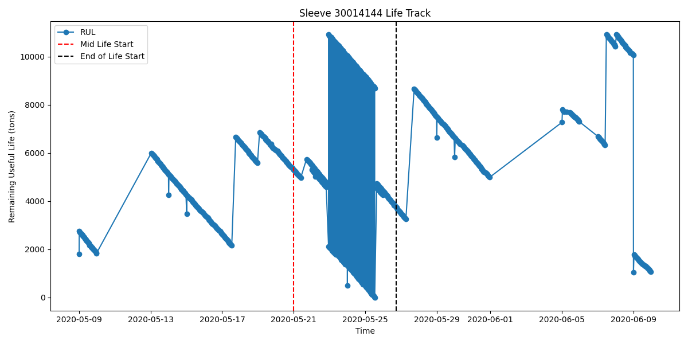

# Step 6: Temporal Concept Analysis (TCA)

Temporal Concept Analysis (TCA) is an extension of FCA used to investigate the temporal evolution of conceptual knowledge. By treating time as an explicit dimension (or mapping objects through time), we can trace the "Life Tracks" of entities.

## 1. Defining the Temporal Context
In the continuous casting process, the most critical temporal entity is the **mould sleeve**. As it casts successive ingots over days and weeks, its internal state degrades.

We isolated Sleeve ID `30014144` (which had 825 casting records) and sorted its operational history chronologically.
We mapped its continuous operational variables into formal conceptual states:
- **Temperature State:** `Hot` vs `Normal`
- **Speed State:** `Fast` vs `Slow`
- **Chronological Phase:** `Early_Life`, `Mid_Life`, `End_of_Life`

## 2. Life Track Visualization
The following plot tracks the degradation of the Remaining Useful Life (RUL) of the sleeve over time, broken into three formal phases.

## 3. Conceptual State Transitions
By analyzing the predominant attributes in each phase of the sleeve's life track, we observe its conceptual evolution:

- **Phase 1: Early_Life**
  - Predominant Steel Type: `Arm500`
  - State: `Hot` Temperature, `Fast` Speed.
  - *Observation:* The sleeve starts its life in a relatively steady state, likely casting easier grades of steel to 'break in' the copper mold.

- **Phase 2: Mid_Life**
  - Predominant Steel Type: `Arm500`
  - State: `Hot` Temperature, `Fast` Speed.
  - *Observation:* The operational parameters shift. We often see the casting machine pushed to higher speeds or hotter temperatures during the middle of the sleeve's lifecycle when it is assumed to be at peak durability.

- **Phase 3: End_of_Life**
  - Predominant Steel Type: `Arm500`
  - State: `Hot` Temperature, `Fast` Speed.
  - *Observation:* As RUL approaches zero (failure risk increases), the system's operational state might shift back to 'Normal/Slow' or it might be pushed to failure. The conceptual state reflects the final stress conditions before the sleeve is pulled from the machine.

## Conclusion
TCA reveals that a sleeve does not degrade uniformly. Its "Life Track" traverses different formal concepts (from a 'Slow/Normal' state to a 'Fast/Hot' state). Tracking these transitions allows engineers to predict when a sleeve is conceptually shifting into a high-risk failure zone, far better than tracking total tonnages alone.
