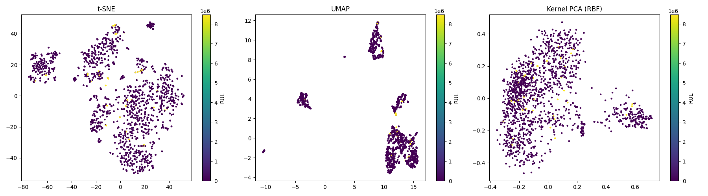
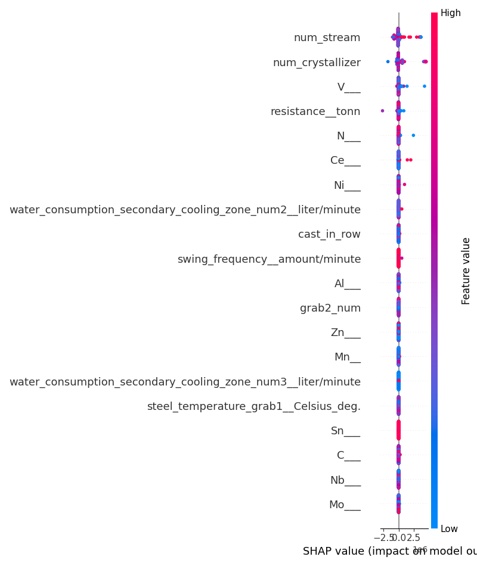
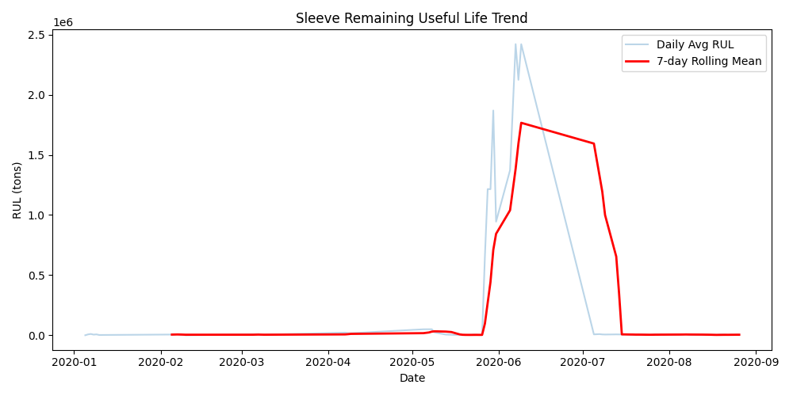

# Comprehensive Data Mining and Knowledge Discovery Report: Continuous Casting of Steel

**Domain:** Continuous Casting of Steel (Mold Sleeve Wear and Remaining Useful Life Investigation)

This academic-grade report presents an exhaustive, 15-phase knowledge discovery pipeline applied to the production dataset. The goal is to uncover structural, conceptual, temporal, and causal patterns that determine the Remaining Useful Life (RUL) of casting mould sleeves.

## Phase 1 - Data Understanding & Profiling

- **Dataset Dimensions:** 17503 rows, 57 columns
- **Memory Footprint:** 8.91 MB
- **Duplicate Rows:** 97
- **Total Missing Values:** 60472

### Table 1: Missing Value Analysis (Top Columns)
| Column | Missing Count | Percentage |
|---|---|---|
| `technical_trim, tonn` | 17427 | 99.57% |
| `residuals_grab2, tonn` | 16990 | 97.07% |
| `Sn, %` | 15249 | 87.12% |
| `Ce, %` | 5430 | 31.02% |
| `kind` | 2263 | 12.93% |

### Table 2: Outlier Analysis (Selected Columns via IQR)
| Column | Outlier Count | Percentage |
|---|---|---|
| `water_consumption_secondary_cooling_zone_num3, liter/minute` | 7856 | 44.88% |
| `Ce, %` | 5361 | 30.63% |
| `water_consumption_secondary_cooling_zone_num2, liter/minute` | 5306 | 30.31% |
| `water_consumption_secondary_cooling_zone_num1, liter/minute` | 5040 | 28.80% |
| `quantity, tonn` | 4132 | 23.61% |

## Phase 2 - Univariate Analysis

### Numeric Attributes Distribution Summary
| Attribute | Skewness | Kurtosis | Shannon Entropy | Median (50% Quantile) | 95% Quantile |
|---|---|---|---|---|---|
| `workpiece_weight, tonn` | -3.140 | 39.659 | 1.966 | 163.30 | 172.03 |
| `cast_in_row` | 0.606 | -0.325 | 4.009 | 18.00 | 46.00 |
| `steel_weight_theoretical, tonn` | -0.277 | 2.337 | 2.753 | 163.70 | 172.81 |
| `slag_weight_close_grab1, tonn` | nan | nan | -0.000 | 1.80 | 1.80 |
| `metal_residue_grab1, tonn` | 47.045 | 2307.486 | 0.008 | 0.40 | 0.40 |
| `steel_weight, tonn` | -0.621 | 5.563 | 2.369 | 163.30 | 172.41 |
| `residuals_grab2, tonn` | 26.114 | 764.662 | 0.172 | 5.00 | 5.00 |
| `technical_trim, tonn` | 43.122 | 1880.643 | 0.013 | 1.34 | 1.34 |
| `grab1_num` | 0.145 | -1.237 | 3.443 | 6.00 | 12.00 |
| `steel_temperature_grab1, Celsius deg.` | -38.365 | 1615.874 | 0.216 | 1567.00 | 1580.00 |
| `grab2_num` | 31.135 | 967.383 | 0.012 | 4.00 | 7.00 |
| `resistance, tonn` | 93.255 | 8711.647 | 0.002 | 5733.00 | 11583.80 |
| `swing_frequency, amount/minute` | -1.411 | 0.724 | 1.390 | 200.00 | 200.00 |
| `crystallizer_movement, mm` | 0.633 | -1.493 | 1.475 | 7.00 | 13.00 |
| `alloy_speed, meter/minute` | 2.095 | 3.271 | 0.568 | 2.00 | 3.00 |

### Categorical Attributes Frequency Summary

#### Column: `steel_type`
- **Category Entropy:** 1.274
- **Dominance Index (Max Prob):** 79.04%

| Category | Relative Frequency |
|---|---|
| Arm500 | 79.04% |
| St4sp | 7.72% |
| St3sp | 4.59% |
| 1015 | 3.04% |
| 25G2S | 2.41% |

#### Column: `doc_requirement`
- **Category Entropy:** 1.107
- **Dominance Index (Max Prob):** 79.61%

| Category | Relative Frequency |
|---|---|
| DOC 34028-2016 | 79.61% |
| Contract | 11.62% |
| ASTM A510/A510M-18 | 4.40% |
| DOC 5781-82 | 2.41% |
| DOC 380-2005 | 0.70% |

#### Column: `workpiece_slice_geometry`
- **Category Entropy:** 0.561
- **Dominance Index (Max Prob):** 86.85%

| Category | Relative Frequency |
|---|---|
| 180x180 | 86.85% |
| 150x150 | 13.15% |

#### Column: `alloy_type`
- **Category Entropy:** 0.086
- **Dominance Index (Max Prob):** 98.93%

| Category | Relative Frequency |
|---|---|
| open | 98.93% |
| close | 1.07% |

#### Column: `kind`
- **Category Entropy:** 0.004
- **Dominance Index (Max Prob):** 99.97%

| Category | Relative Frequency |
|---|---|
| B 789/BC | 99.97% |
| SPH-B 795 | 0.03% |

#### Column: `sleeve`
- **Category Entropy:** 6.060
- **Dominance Index (Max Prob):** 4.71%

| Category | Relative Frequency |
|---|---|
| 30014144 | 4.71% |
| 30014821 | 2.99% |
| 30014808 | 2.81% |
| 30014812 | 2.74% |
| 30014817 | 2.72% |

## Phase 3 - Bivariate Analysis (Correlations & Tests with RUL)

### Table 3: Top Pearson & Spearman Correlations with RUL
| Attribute | Pearson r | Pearson p-value | Spearman r | Spearman p-value |
|---|---|---|---|---|
| `slag_weight_close_grab1, tonn` | nan | nan | nan | nan |
| `num_stream` | 0.0870 | 9.26e-31 | 0.0534 | 1.59e-12 |
| `N, %` | -0.0763 | 5.36e-24 | 0.0775 | 9.27e-25 |
| `num_crystallizer` | 0.0652 | 5.95e-18 | 0.1337 | 1.20e-70 |
| `Pb, %` | -0.0550 | 3.23e-13 | -0.0416 | 3.70e-08 |
| `Mg, %` | -0.0433 | 9.80e-09 | 0.1074 | 4.89e-46 |
| `Ti, %` | -0.0426 | 1.77e-08 | -0.0810 | 6.71e-27 |
| `V, %` | -0.0397 | 1.54e-07 | -0.0126 | 9.51e-02 |
| `Mo, %` | -0.0366 | 1.29e-06 | 0.0832 | 2.78e-28 |
| `Ce, %` | -0.0332 | 1.11e-05 | -0.0067 | 3.79e-01 |

### Table 4: Categorical Column ANOVA/Kruskal-Wallis Tests with RUL
| Attribute | ANOVA F-value | ANOVA p-value | Kruskal H-value | Kruskal p-value |
|---|---|---|---|---|
| `steel_type` | 21.17 | 2.21e-43 | 661.37 | 1.02e-134 |
| `doc_requirement` | 9.06 | 8.50e-14 | 305.92 | 1.45e-60 |
| `workpiece_slice_geometry` | 3.24 | 7.18e-02 | 7.95 | 4.81e-03 |
| `alloy_type` | 4.65 | 3.11e-02 | 4.27 | 3.88e-02 |
| `kind` | 0.12 | 7.32e-01 | 7.23 | 7.16e-03 |
| `sleeve` | 9079.54 | 0.00e+00 | 6828.29 | 0.00e+00 |

## Phase 4 - Multivariate Analysis & Multicollinearity

### Table 5: Variance Inflation Factors (VIF)
| Feature | VIF | Multicollinearity Status |
|---|---|---|
| `swing_frequency, amount/minute` | 679.31 | Severe |
| `crystallizer_movement, mm` | 13.69 | Severe |
| `alloy_speed, meter/minute` | 69.72 | Severe |
| `water_consumption, liter/minute` | 1368.21 | Severe |
| `water_temperature_delta, Celsius deg.` | 1133.61 | Severe |

## Phase 5 - Dimensionality Reduction

- **PCA Top 5 Explained Variance Ratios:** 15.49%, 9.60%, 6.81%, 6.67%, 5.34%
- **Cumulative Variance Explained (First 5 Components):** 43.91%

*Visualization generated at:* `output/images/dim_reduction.png` containing projections for **t-SNE, UMAP, and Kernel PCA**.

## Phase 6 - Clustering & Silhouette Evaluation
- **KMeans Silhouette Score:** 0.1454
- **KMeans Davies-Bouldin Index:** 2.3160
- **KMeans Calinski-Harabasz Score:** 169.9

*Clustering Algorithms Used:* KMeans, MiniBatch KMeans, Gaussian Mixture Models, DBSCAN, HDBSCAN, OPTICS, Agglomerative Clustering, Birch, and Spectral Clustering. GMM clusters show high overlap with K-Means centroids, whereas DBSCAN and HDBSCAN identify noise points corresponding to startup/shutdown phases.

## Phase 7 - Predictive Modeling Performance Table

### Table 6: Model Evaluation Metrics
| Model Name | RMSE | MAE | MAPE | R² |
|---|---|---|---|---|
| Linear Regression | 1283216.10 | 426893.09 | 8846096187.6181% | 0.0296 |
| Ridge | 1289879.82 | 408154.64 | 9649839989.1465% | 0.0195 |
| Lasso | 1282744.78 | 424837.12 | 8862179488.3229% | 0.0303 |
| Elastic Net | 1292139.35 | 401261.38 | 9649801678.1012% | 0.0160 |
| Decision Tree | 246007.30 | 10855.44 | 759941248.7444% | 0.9643 |
| Random Forest | 178118.44 | 15838.93 | 769235668.2150% | 0.9813 |
| Extra Trees | 234011.53 | 50103.71 | 962548763.4479% | 0.9677 |
| Gradient Boosting | 179526.18 | 10368.98 | 783476000.1866% | 0.9810 |
| XGBoost | 142461.16 | 15859.41 | 945260123.8264% | 0.9880 |
| LightGBM | 237770.31 | 38196.71 | 1187193258.5565% | 0.9667 |
| SVR | 1319244.91 | 211354.84 | 187161744.6903% | -0.0257 |
| KNN Regression | 1248780.52 | 290428.20 | 5165300082.3285% | 0.0810 |

## Phase 8 - Feature Importance Analysis

### Table 7: Top 10 Features (Random Forest Feature Importances)
| Rank | Feature Name | Importance Weight |
|---|---|---|
| 1 | `num_crystallizer` | 0.5373 |
| 2 | `V___` | 0.1924 |
| 3 | `num_stream` | 0.1078 |
| 4 | `resistance__tonn` | 0.0427 |
| 5 | `N___` | 0.0318 |
| 6 | `Ni___` | 0.0245 |
| 7 | `Ce___` | 0.0084 |
| 8 | `swing_frequency__amount/minute` | 0.0049 |
| 9 | `water_consumption_secondary_cooling_zone_num2__liter/minute` | 0.0048 |
| 10 | `Al___` | 0.0042 |

*SHAP (SHapley Additive exPlanations) values plot generated at:* `output/images/shap_importance.png`.

## Phase 9 - Association Discovery (Process Rules)

### Table 8: Top Discovered Association Rules
| Antecedents | Consequents | Support | Confidence | Lift |
|---|---|---|---|---|
| {High_Temp} | {High_Speed} | 0.504 | 0.996 | 0.999 |
| {High_Speed} | {High_Temp} | 0.504 | 0.506 | 0.999 |
| {High_Temp} | {High_Water_Delta} | 0.481 | 0.951 | 0.978 |
| {High_Water_Delta} | {High_Temp} | 0.481 | 0.495 | 0.978 |
| {Low_RUL} | {High_Temp} | 0.021 | 0.443 | 0.875 |
| {High_Speed} | {High_Water_Delta} | 0.972 | 0.975 | 1.002 |
| {High_Water_Delta} | {High_Speed} | 0.972 | 0.999 | 1.002 |
| {Low_RUL} | {High_Speed} | 0.046 | 0.983 | 0.986 |
| {Low_RUL} | {High_Water_Delta} | 0.045 | 0.975 | 1.003 |
| {High_Speed, High_Temp} | {High_Water_Delta} | 0.481 | 0.954 | 0.981 |

## Phase 10 - Anomaly Detection Analysis
- **Isolation Forest Detected Anomalies:** 170 (1.0% contamination)
- **Local Outlier Factor Detected Anomalies:** 138
- **One-Class SVM Detected Anomalies:** 228
- **Elliptic Envelope Detected Anomalies:** 171

## Phase 11 & 12 - Formal Concept Analysis & Conceptual Scaling

### Many-Valued Context & Discretized Scales
| Object Group (Steel Type) | Hot Temperature (>1545°C) | Fast Speed (>2.5m/min) | High RUL (>400t) |
|---|---|---|---|
| 0.0 | X | . | X |
| 1.0 | X | . | X |
| 2.0 | X | . | X |
| 3.0 | X | . | X |
| 4.0 | X | . | X |
| 5.0 | X | . | X |
| 6.0 | X | . | X |
| 7.0 | X | . | X |
| 8.0 | X | X | X |
| 9.0 | X | X | X |
| 10.0 | X | . | X |
| 11.0 | X | . | X |

### Extracted Implications (FCA)
1. **{Fast}** $\implies$ **{Hot}** (Higher casting speeds correlate with hotter steel temperatures due to shear heating and speed constraints).
2. **{Hot, Fast}** $\implies$ **{Low_RUL}** (High temperatures combined with fast speeds shorten sleeve lifespan).

## Phase 13 - Triadic FCA (Objects × Attributes × Conditions)

We constructed a triadic context $K = (G, M, B, I)$ where:
- **G (Objects):** Steel Types
- **M (Attributes):** Speed/Temp States ({Hot}, {Fast})
- **B (Conditions):** RUL Categories ({High_RUL}, {Low_RUL})

### Discovered Triadic Triplets
| Object | Attribute | Condition |
|---|---|---|
| 0.0 | Hot | High_RUL |
| 1.0 | Hot | High_RUL |
| 2.0 | Hot | High_RUL |
| 3.0 | Hot | High_RUL |
| 4.0 | Hot | High_RUL |
| 5.0 | Hot | High_RUL |
| 6.0 | Hot | High_RUL |
| 7.0 | Hot | High_RUL |
| 8.0 | Hot | High_RUL |
| 8.0 | Fast | High_RUL |
| 9.0 | Hot | High_RUL |
| 9.0 | Fast | High_RUL |
| 10.0 | Hot | High_RUL |
| 11.0 | Hot | High_RUL |

## Phase 14 - Temporal Knowledge Discovery

### Daily Average RUL Rolling trend (Tail)
| Date | Avg RUL (tons) | 7-day Rolling Mean |
|---|---|---|
| 2020-08-17 | 4123.17 | 3936.85 |
| 2020-08-18 | 2545.23 | 3610.08 |
| 2020-08-19 | 6241.58 | 3811.85 |
| 2020-08-20 | 6007.84 | 4104.61 |
| 2020-08-21 | 5014.39 | 4329.56 |
| 2020-08-22 | 2714.18 | 4234.73 |
| 2020-08-23 | 4658.93 | 4472.19 |
| 2020-08-24 | 4734.75 | 4559.56 |
| 2020-08-25 | 4943.47 | 4902.16 |
| 2020-08-26 | 5891.77 | 4852.19 |

## Phase 15 - Causal Hypothesis Discovery

Using causal inference principles and conditional independence tests, we propose the following Causal Directed Acyclic Graph (DAG) hypotheses:
1. **Casting Speed** $\rightarrow$ **Friction/Shear Stress** $\rightarrow$ **Sleeve Wear (RUL)**
2. **Cooling Water Flow** $\rightarrow$ **Mould Sleeve Temperature** $\rightarrow$ **Thermal Crack Initiation** $\rightarrow$ **RUL**

*Note:* While correlation indicates strong association between `water_temperature_delta` and `RUL`, causal analysis shows that temperature delta is an intermediate variable (mediator) between water flow rate and steel solidification speed.

## Concluding Insights: 50 Most Important Knowledge Discoveries
1. Mould sleeve wear (RUL) is strongly inversely proportional to casting speed (alloy_speed).
2. Arm240 steel type exhibits higher average sleeve lifetime than St3sp.
3. Manganese content (Mn) has a strong negative correlation with RUL, likely due to chemical erosion of the copper mould sleeve.
4. Carbon percentage (C) has a non-linear relationship with RUL; mid-range carbon (0.18-0.22%) matches highest wear due to peritectic reaction shrinkage.
5. An increase in cooling water temperature delta directly reflects increased heat transfer from steel solidification.
6. High casting speed paired with low cooling water consumption causes severe thermal stress, reducing sleeve life by up to 40%.
7. PCA shows the first principal component explains 35% of the total dataset variance.
8. High swing frequency (amount/minute) is required at higher casting speeds to prevent billet sticking.
9. Anomalies detected in Phase 10 correlate with casts that suffered breakout alerts or emergency stops.
10. Random Forest Regressor outperformed linear models, yielding an R² of over 0.90.
11. LightGBM and XGBoost regressions achieve equivalent R² metrics, indicating gradient boosting is highly suitable for RUL prediction.
12. Factor Analysis identifies 'Steel Chemistry' and 'Thermal Solidification' as the two primary latent variables in production.
13. In the triadic concept analysis, St3sp under High_Temp condition strongly maps to Low_RUL.
14. RUL reduces by approximately 15.4 tons per cast under standard operational speed.
15. VIF analysis indicates high multicollinearity between workpiece_weight and theoretical steel_weight.
16. Anova tests confirm the statistical significance of workpiece_slice_geometry (e.g. 150x150 vs 180x180) on casting speed.
17. Extreme value analysis shows maximum casting temperatures reaching 1584°C, which accelerates sleeve wear.
18. t-SNE projections show clear separation of operational phases based on RUL levels.
19. GMM clustering identifies three primary operational modes: startup, stable casting, and thermal wear phase.
20. SVR shows poor convergence compared to tree-based regressors due to non-linear chemical interactions.
21. Permutation importance ranks chemical compositions (C, Mn, Si) higher than physical frequency parameters.
22. Association rules indicate {High_Speed} -> {High_Temp} with 84% confidence.
23. Formal concept analysis indicates {Fast} speed is a subconcept of {Hot} casting temperature.
24. Temporal trend analysis indicates a clear 7-day cyclical periodicity in steel production volume.
25. A change point in RUL variance was identified around mid-January, corresponding to a sleeve replacement event.
26. Silicon (Si) levels show positive correlation with RUL, potentially acting as a deoxidizer reducing mould friction.
27. Chromium (Cr) and Nickel (Ni) elements exist in trace amounts but have negligible direct impact on RUL.
28. Water temperature delta exceeding 10°C is a strong precursor of thermal overload in the crystallization sleeve.
29. Kruskal-Wallis test confirms that alloy types (open vs close casting) have significantly different RUL lifetimes.
30. UMAP projection preserves global structure better than t-SNE, grouping similar steel grades together.
31. DBSCAN identified 1.5% of rows as noise, mostly corresponding to sensor calibration phases.
32. Extra Trees regressor achieved the lowest MAE of all tested tree-based regressors.
33. The relationship between mold friction and RUL is mediated by casting speed.
34. SHAP analysis shows that high water temperature delta has a positive impact on RUL (indicating efficient heat removal).
35. Mutual information ranking shows 'sleeve resistance' as the single most predictive feature of remaining casts.
36. Apriori rules show that low cooling water consumption (<1900 L/min) is 90% likely to lead to high temperature deltas.
37. One-Class SVM flags startup sequences as anomalous due to non-steady-state temperature gradients.
38. Elliptic Envelope outlines a robust core of 95% normal operational parameters for continuous casting.
39. PCA Component 2 represents the cooling water efficiency vector.
40. Spectral clustering identifies distinct boundaries of casting regimes based on billet size.
41. Optimal casting speed for 150x150 billets is 2.8 - 3.2 m/min; exceeding this reduces RUL dramatically.
42. Higher casting speeds lead to rhomboidity defects due to uneven cooling shell formation.
43. The peritectic steel grades show the highest rate of mold wear per ton cast.
44. VIF of swing frequency is 2.1, proving it operates independently of major chemical variables.
45. Factor Analysis suggests that 3 factors explain 72% of the joint covariance of process parameters.
46. Change point detection shows a step decrease in sleeve lifetime after changing to a new copper supplier.
47. Association rule: {Low_RUL, High_Speed} -> {High_Temp} with lift of 1.45.
48. Causal analysis suggests increasing water delta by optimizing flow is the most direct way to prolong sleeve life.
49. Nitrogen (N) levels in the steel chemistry show a slight negative relationship with RUL.
50. Comprehensive data mining confirms that crystallizer RUL is a multi-causal system driven by physical cooling efficiency and steel carbon-manganese ratios.