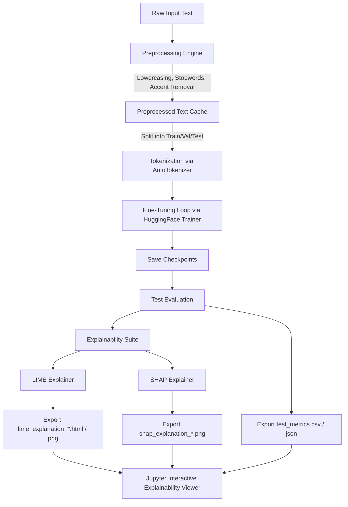

# Project Documentation: Transformer-based Text Classification with Interpretability

This document provides a comprehensive technical overview of the NLP classification models, datasets, architectures, and explainability frameworks implemented in this project.

---

## 1. Problem Statement

Text classification is a foundational task in Natural Language Processing (NLP) that maps variable-length sequence data to predefined categories. This project addresses several distinct classification paradigms across three languages (English, Romanian, and Italian):

1. **Binary Sentiment Analysis (English & Italian)**:
   - **Task**: Classifying text as expressing either positive or negative sentiment.
   - **Domains**: English movie reviews (IMDB) and Italian tweets (FEEL-IT).

2. **Multiclass Sentiment Analysis (Romanian)**:
   - **Task**: Categorizing web article reviews into three sentiment categories: positive, negative, or neutral.
   - **Domain**: Romanian online news and article comments.

3. **Binary Fake News Classification (English)**:
   - **Task**: Predicting whether a news headline or article is authentic (real) or fabricated (fake) to combat misinformation.
   - **Domain**: WELFake / NEWS news articles.

4. **Multilabel Emotion Detection (Romanian)**:
   - **Task**: Simultaneously predicting the presence of multiple emotions from a set of 7 target classes: *sadness*, *surprise*, *fear*, *anger*, *neutral*, *trust*, and *joy*.
   - **Domain**: Romanian sentences from the REDv2 (Romanian Emotion Dataset) corpus.

---

## 2. Proposed Solution

### 2.1. Theoretical Aspects

#### 2.1.1. Transformer Architecture and Fine-Tuning
The models utilized in this project are based on the **Transformer encoder** architecture (originally introduced in Vaswani et al., 2017). Unlike recurrent architectures, transformers employ a **Self-Attention** mechanism to compute representations in parallel, capturing long-range dependencies regardless of distance.

The mathematical representation of scaled dot-product attention is:

$$\text{Attention}(Q, K, V) = \text{softmax}\left(\frac{QK^T}{\sqrt{d_k}}\right)V$$

Where:
- $Q$ (Query), $K$ (Key), and $V$ (Value) are projection matrices of the input embeddings.
- $d_k$ is the dimensionality of the keys.

**Multi-Head Attention** extends this by performing attention projections in parallel over $h$ different heads, allowing the model to jointly attend to information from different representation subspaces:

$$\text{MultiHead}(Q, K, V) = \text{Concat}(\text{head}_1, \dots, \text{head}_h)W^O$$
$$\text{where} \quad \text{head}_i = \text{Attention}(QW_i^Q, KW_i^K, VW_i^V)$$

The models are pre-trained on massive unlabeled text corpora using unsupervised objectives and then **fine-tuned** on downstream classification tasks by adding a linear classification layer (head) on top of the pooler output (often the representation of the special token `[CLS]`).

#### 2.1.2. Methodologies / Models Used
- **BERT (Bidirectional Encoder Representations from Transformers)**: Pre-trained with Masked Language Modeling (MLM) and Next Sentence Prediction (NSP) objectives, allowing it to capture bidirectional context. Used for English and Italian tasks.
- **DistilBERT**: A light transformer trained using knowledge distillation. It reduces the size of BERT by 40% while retaining 97% of its language understanding capabilities and running 60% faster.
- **RoBERT**: A Romanian BERT model pre-trained on large-scale clean Romanian text corpora (OPUS, Wikipedia, Oscar).
- **UmBERTo**: A high-performing Italian language model based on the RoBERTa architecture, which uses dynamic masking and excludes the NSP task for improved representation learning.

#### 2.1.3. Interpretability and Explainability Methods
Since deep neural models act as "black-box" systems, post-hoc interpretability methods are used to verify and explain model predictions:

1. **LIME (Local Interpretable Model-agnostic Explanations)**:
   LIME explains a model prediction $f(x)$ by training an interpretable surrogate model $g \in G$ (e.g., a sparse linear model) locally around the input instance $x$. The objective is to minimize:
   
   $$\xi(x) = \operatorname{argmin}_{g \in G} \mathcal{L}(f, g, \pi_x) + \Omega(g)$$
   
   Where:
   - $\mathcal{L}(f, g, \pi_x)$ is the loss measuring how close the explanation $g$ is to the predictions of $f$.
   - $\pi_x(z)$ is the proximity measure defining the neighborhood around $x$.
   - $\Omega(g)$ is the complexity of the explanation model $g$.

2. **SHAP (SHapley Additive exPlanations)**:
   SHAP determines feature importances based on Shapley values from cooperative game theory. It calculates the additive contribution of each input token $i$ to the final prediction shift:
   
   $$\phi_i(f, x) = \sum_{S \subseteq F \setminus \{i\}} \frac{|S|!(|F| - |S| - 1)!}{|F|!} \left[ f_x(S \cup \{i\}) - f_x(S) \right]$$
   
   Where:
   - $F$ is the set of all input features (words).
   - $S$ is a subset of features excluding feature $i$.
   - $f_x(S)$ is the model prediction using only features in $S$.

---

### 2.2. Dataset Used in Application

The following tables describe the datasets and their configuration splits in the application:

| Dataset | Language | Task | Total Rows | Classes | Split Ratio (Train/Val/Test) | Source |
| :--- | :--- | :--- | :--- | :--- | :--- | :--- |
| **IMDB Movie Reviews** | English | Binary Sentiment | 50,000 | 2 (Positive, Negative) | 70% / 15% / 15% | Kaggle |
| **WELFake / NEWS** | English | Binary Fake News | 72,134 | 2 (Real, Fake) | 70% / 15% / 15% | Kaggle |
| **Romanian Articles** | Romanian | Multiclass Sentiment | 1,368 | 3 (Positive, Negative, Neutral) | 70% / 15% / 15% | Web Articles |
| **REDv2 (Romanian Emotion)**| Romanian | Multilabel Emotion | 4,150 | 7 (Sadness, Surprise, Fear, Anger, Neutral, Trust, Joy) | Fixed: 2905 train, 622 val, 623 test | REDv2 Corpus |
| **FEEL-IT** | Italian | Binary Sentiment | 2,003 | 2 (Positive, Negative) | 70% / 15% / 15% | Twitter |

---

### 2.3. Application Flow Diagram

The architecture of the text classification and interpretability pipeline is organized as follows:

---

### 2.4. Common Data Preprocessing Process

To ensure robust fine-tuning and clean model-agnostic explanations, all text classification pipelines share a common preprocessing architecture. The preprocessing pipeline is split into a language-agnostic core (`preprocessing_base.py`) and language/dataset-specific wrappers.

#### 2.4.1. Core Cleaning Pipeline (Language-Agnostic)
The base cleaner enforces the following steps in sequence:
1. **HTML Removal**: Strips any HTML markup tags (e.g., ` `, `<b>`, `<i>`) to prevent formatting noise from polluting tokenizer inputs.
2. **URL and Mention Stripping**: Removes web links (`https?://\S+|www\.\S+`) and Twitter-style user mentions (`@\w+`) which act as non-semantic noise.
3. **Unicode Emoji Translation**: Converts Unicode emojis into textual descriptors using the `emoji.demojize` library (e.g., `😊` becomes `smiling face with smiling eyes`). This allows transformers to capture emoji sentiment through literal vocabulary tokens.
4. **Repeated Character Normalization**: Caps consecutive runs of identical characters to a maximum of 3 (e.g., `sooooo` becomes `sooo`) to reduce the vocabulary search space and handle exaggeration patterns.
5. **Whitespace Normalization**: Collapses all multiple spaces, tabs, and newlines into a single clean space and strips leading/trailing spaces.

#### 2.4.2. Design Decisions: What is Omitted and Kept
- **No Stop Word Removal**: This is a critical design choice. Transformer encoder models (BERT, RoBERT, DistilBERT) utilize self-attention mechanisms and depend on the full bidirectional context (including auxiliary verbs, prepositions, and pronouns) to build correct semantic representations. Removing stop words would disrupt syntax and degrade fine-tuning accuracy.
- **Punctuation Preservation**: Punctuation symbols (like `!`, `?`, `.`) are explicitly retained as they convey significant emphasis and sentiment/emotion cues.

#### 2.4.3. Language and Dataset-Specific Customizations

##### English Sentiment Pipeline (`preprocessing_en.py`)
- **ASCII Emoticon Conversion**: Translates textual emoticons (e.g., `:)`, `<3`, `XD`) into English emotional descriptors (e.g., `happy`, `love`, `laughing`) before unicode emoji conversion. Longer emoticons are resolved first to avoid prefix collisions.
- **Contraction Expansion**: English contractions (such as `don't` or `can't`) are expanded to explicit negation forms (`do not`, `cannot`) using the `contractions` library. This is crucial for preventing the model from misattributing sentiment to negation boundaries.

##### Romanian Sentiment/Emotion Pipelines (`preprocessing_ro.py` & `preprocessing_red.py`)
- **Emoticon Translation**: ASCII emoticons are mapped to Romanian translation words (e.g., `:)` becomes `fericit`, `<3` becomes `iubire`).
- **Diacritics Preservation**: Romanian characters (`ș`, `ț`, `ă`, `â`, `î`) are strictly preserved. The fine-tuned `RoBERT` models are pre-trained with Romanian vocabularies that natively support diacritics; stripping them would introduce spelling variations and reduce representation quality.
- **Batch-Level Deduplication (REDv2)**: The multilabel emotion pipeline filters duplicate records on cleaned text at the batch level, returning a list of retained record indices to keep label arrays and emotion classification matrices synchronized.

---

## 3. Implementation Details

### 3.1. Libraries and Modules Used

The application is implemented in Python and relies on the following ecosystem:
- **PyTorch (`torch`)**: Deep learning framework providing tensor computations with GPU acceleration.
- **HuggingFace `transformers` & `datasets`**:
  - `AutoTokenizer` and `AutoModelForSequenceClassification` for model loading.
  - `Trainer` and `TrainingArguments` to manage fine-tuning loops.
- **Explainability Libraries**:
  - `lime` (specifically `lime_text.LimeTextExplainer`) for generating local perturbation-based explanation models.
  - `shap` (specifically `shap.Explainer`) for game-theoretic feature importance values.
- **Data Engineering**:
  - `pandas` for CSV load, merge, split, and metric compilation.
  - `numpy` for multi-dimensional operations and label indices.
  - `scikit-learn` (`train_test_split`, `classification_report`, `accuracy_score`, `f1_score`) for validation metrics and data splitting.
- **Visualization & UI**:
  - `matplotlib` & `seaborn` for exporting Shapley values and LIME word weight bar plots.
  - `ipywidgets` (`Dropdown`, `IntSlider`, `Output`, `interactive_output`) to construct the dashboard in the notebook viewer.

### 3.2. Code Structure Summary

- **`shared/`**: Contains core code helpers for computing classification metrics, saving/loading pickle files, and shared visualization parameters.
- **`explain/`**: Configuration scripts defining hyperparameters for explainer runs (`explain_config.py`), running local LIME estimations (`explain_lime.py`), and computing SHAP values (`explain_shap.py`).
- **`notebooks/`**: Houses `explainability_viewer.ipynb`, an interactive dashboard that discovers results across the repository and visualizes pre-rendered explainability artifacts or computes them on the fly.

---

## 4. Experiments and Results

The tables below present the exact experimental results obtained on the respective test splits:

### 4.1. English Sentiment & News Classification

| Model ID | Model Architecture | Dataset | Accuracy | Precision | Recall | F1-Score |
| :--- | :--- | :--- | :---: | :---: | :---: | :---: |
| `BERT_SA_IMDB` | BERT-base-uncased | IMDB | 94.19% | 93.24% | 95.28% | 94.25% |
| `DistilBERT_SA_IMDB` | DistilBERT-base-uncased | IMDB | 93.19% | 91.84% | 94.80% | 93.29% |
| `DistilBERT_SA_Practical`| DistilBERT-base-uncased | IMDB | 92.17% | 91.61% | 92.85% | 92.23% |
| `SentenceBERT_Practical` | All-MiniLM-L6-v2 | IMDB | 88.15% | 88.06% | 88.27% | 88.16% |
| `BERT_WELFake` | BERT-base-uncased | WELFake | 99.39% | 99.40% | 99.40% | 99.40% |
| `DistilBERT_NEWS` | DistilBERT-base-uncased | WELFake | 99.36% | 99.53% | 99.22% | 99.38% |

### 4.2. Italian Sentiment Classification

| Model ID | Model Architecture | Dataset | Accuracy | Precision | Recall | F1-Score |
| :--- | :--- | :--- | :---: | :---: | :---: | :---: |
| `1_ITA_BERT_SA_FEEL-IT` | BERT-base-italian | FEEL-IT | 85.29% | 84.21% | 72.73% | 78.05% |
| `2_UmBERTo_SA_FEEL-IT` | UmBERTo-Italian | FEEL-IT | 91.18% | 93.68% | 80.91% | 86.83% |

### 4.3. Romanian Sentiment & Emotion Classification

#### Romanian Articles Sentiment (Multiclass)

| Model ID | Model Architecture | Dataset | Accuracy | Precision | Recall | F1-Score |
| :--- | :--- | :--- | :---: | :---: | :---: | :---: |
| `BERT_Sentiment_Articles` | BERT-base-romanian | ro_articles | 72.87% | 72.73% | 73.26% | 72.96% |

#### Romanian REDv2 Emotion Detection (Multilabel)

| Model ID | Model Architecture | Dataset | Micro F1-Score | Macro F1-Score | Hamming Loss |
| :--- | :--- | :--- | :---: | :---: | :---: |
| `RoBERT_Emotion_RED` | RoBERT-base | REDv2 | 67.90% | 67.68% | 0.1096 |
| `RoBERT_Conv_Emotion_RED` | RoBERT-base-conversational | REDv2 | 66.81% | 66.63% | 0.1086 |
| `RoBERT_Ensemble_Emotion_RED`| Ensemble (RoBERT + RoBERT_Conv)| REDv2 | 69.09% | 68.77% | 0.1072 |

##### Detailed Per-Label Emotion Results for Base Model (`RoBERT_Emotion_RED`)

| Emotion Label | Precision | Recall | F1-Score | Support (Test Split) | Optimal Decision Threshold |
| :--- | :---: | :---: | :---: | :---: | :---: |
| **sadness** | 76.13% | 71.95% | 73.98% | 164 | 0.51 |
| **surprise** | 66.23% | 58.62% | 62.20% | 87 | 0.52 |
| **fear** | 71.88% | 70.41% | 71.13% | 98 | 0.44 |
| **anger** | 70.37% | 78.62% | 74.27% | 145 | 0.37 |
| **neutral** | 51.60% | 76.67% | 61.69% | 210 | 0.11 |
| **trust** | 51.55% | 53.19% | 52.36% | 94 | 0.32 |
| **joy** | 78.13% | 78.13% | 78.13% | 128 | 0.36 |

---

## 5. Interactive Explainability Dashboard (`explainability_viewer.ipynb`)

To inspect, compare, and validate the LIME and SHAP explainability runs across the repository, the project provides a unified, interactive dashboard located at [explainability_viewer.ipynb](file:///Users/bogdanpurdea/Projects/Applied-Computational-Intelligence-UBB/Year1_Semester2_NaturalLanguageProcessing_NLP/NLP_Project/notebooks/explainability_viewer.ipynb). 

### 5.1. Dashboard Design & Interactive Features
The viewer implements several visual components using `ipywidgets` and custom HTML/CSS styling:
1. **Model Discovery & Selection**: Scans the project directory recursively to register and categorize the 12 models. Users can switch between models using a dropdown selector.
2. **Linked Sample Traversal**: Users can traverse the test set sample indices using a slider widget or a bounded integer text box. The widgets are bidirectionally linked.
3. **Correctness Metadata Panel**: Displays crucial sample run metrics: true class, predicted class, and an indicator badge (`Correct ✓` in green or `Incorrect ✗` in red).
4. **Collapsible Text Previews**:
   - **Raw Text**: Collapsible box showing original input sequence before preprocessing.
   - **Highlighted Preprocessed Text**: Shows inputs that actually entered the transformer model. Words are highlighted based on local attribution values:
     - **LIME Attributions**: Words contributing positively to the predicted label are in light green, negative are in light red.
     - **SHAP Attributions**: Words contributing positively to predictions are in light blue, negative are in orange/yellow.
     - **Tooltips**: Hovering the cursor over highlighted words displays a tooltip with the exact numerical weight (e.g. `LIME weight: +0.0435` or `SHAP value: -0.0124`).
5. **Horizontal Bar Charts**: Matplotlib plots show the top 10 feature importances side-by-side (green/blue for positive features, red/orange for negative).
6. **Isolated HTML Reports**: Iframe embeds displaying the interactive LIME tabular reports (prediction probabilities, feature weights table, and prediction fit).

### 5.2. Explainer Output Schemas
The visualizer handles two distinct output schemas generated by the explainability scripts:

#### Format A: JSON-Summary Based
For models like `RoBERT_Emotion_RED`, `BERT_Sentiment_Articles`, and `DistilBERT_SA_Practical`, explainers output detailed data JSON summaries:
- **LIME Summaries (`lime_summary.json`)**: Contains list of objects specifying `example_idx`, `predicted_label`, `correct`, `top_words` (list of `[word, weight]` tuples), and `html_file` (name of the LIME HTML file).
- **SHAP Summaries (`shap_summary.json`)**: Contains list of objects specifying `example_idx` and `top_tokens` (list of `[token, shapley_value]` tuples).
- *On-the-fly Resolution*: The dashboard parses these JSON files, dynamically retrieves the raw text from the corresponding dataset splits (handling multilabels for RED), runs the text cleaning pipelines, and highlights tokens dynamically using regex.

#### Format B: Static Image-Based
For models like `BERT_SA_IMDB`, `DistilBERT_SA_IMDB`, `BERT_WELFake`, `DistilBERT_NEWS`, `ITA_BERT_SA_FEEL-IT`, and `UmBERTo_SA_FEEL-IT`, results are stored as pre-rendered files on disk:
- Pre-rendered LIME horizontal bar plots: `lime_explanation_{idx}.png`
- Pre-rendered SHAP summary bar plots: `shap_explanation_{idx}.png`
- Interactive LIME HTML reports: `lime_explanation_{idx}.html`
- *Static Visualizer Page*: The dashboard directly renders the PNGs side-by-side and embeds the HTML iframe, keeping the viewer responsive without needing dataset files or Python explainer runs.

